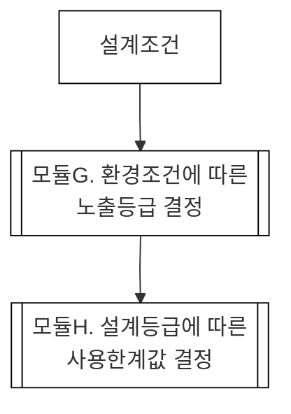

# PSC 거더교 설계조건 선정

```mermaid
%%{ init: { 'flowchart': { 'curve': 'linear' } } }%%
flowchart TD
    n1[설계조건]
    n2[[모듈G. 환경조건에 따른\n노출등급 결정]]
    n3[[모듈H. 설계등급에 따른\n사용한계값 결정]]

    n1-->n2-->n3

    click n2 href "/module/module_g.html"

    %% 스타일 정의
    classDef transparent fill:none,stroke-width:0px
    classDef label fill:none,stroke-width:0px
    classDef white fill:#fff,stroke:#000
    classDef yellow fill:#f2eabd,stroke:#000
    classDef blue fill:#d7e8f5,stroke:#000
    classDef green fill:#d8f5d7,stroke:#000
    classDef gray fill:#ededed,stroke:#000
    classDef orange fill:#edc8ab,stroke:#000

    class n1,n2,n3 white

    
```