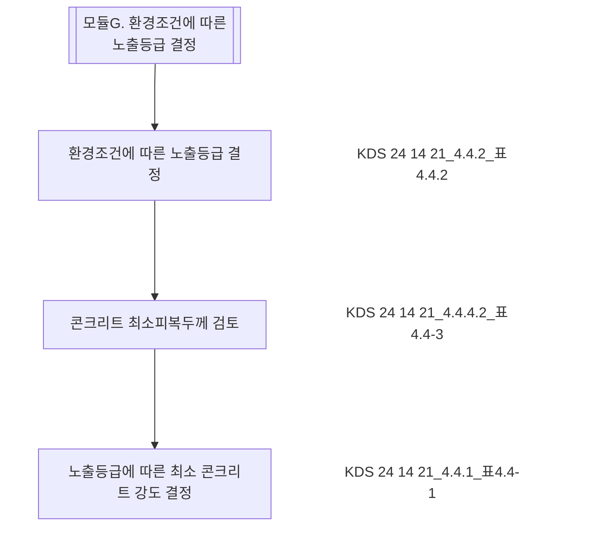

# 모듈G. 환경조건에 따른 노출등급 결정

```mermaid
%%{ init: { 'flowchart': { 'curve': 'linear' } } }%%
flowchart TD
    n1[[모듈G. 환경조건에 따른\n노출등급 결정]]
    subgraph s1[" "]
        n2[환경조건에 따른 노출등급 결정]
        l2[KDS 24 14 21_4.4.2_표4.4.2]
    end
    subgraph s2[" "]
        n3[콘크리트 최소피복두께 검토]
        l3[KDS 24 14 21_4.4.4.2_표4.4-3]
    end
    subgraph s3[" "]
        n4[노출등급에 따른 최소 콘크리트 강도 결정]
        l4[KDS 24 14 21_4.4.1_표4.4-1]
    end

    n1-->n2-->n3-->n4
    
    classDef group fill:none,stroke-width:0px
    class s1,s2,s3 group
    classDef label fill:none,stroke-width:0px
    class l2,l3,l4 label
```